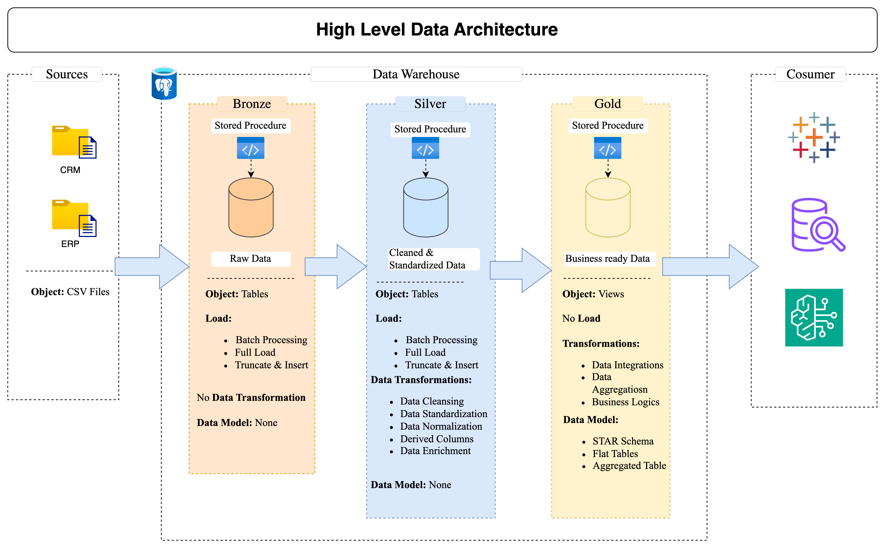
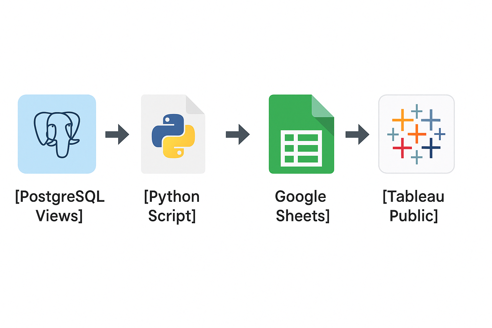
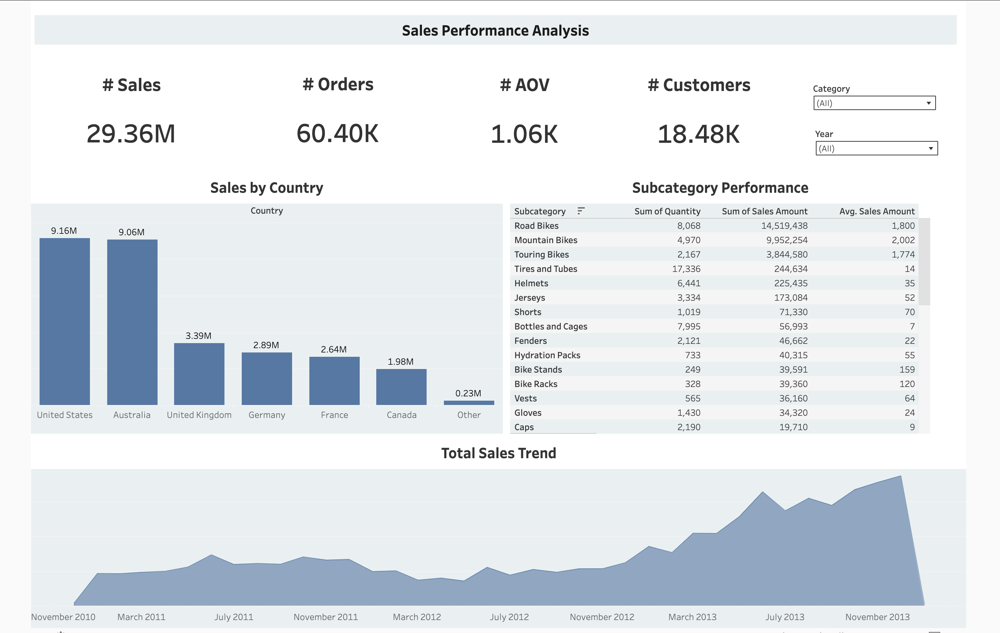

# End to End Data Engineering/Analytics Project using PostgreSQL, Python, Google Sheets API & Tableau

Welcome to the **Data Warehouse and Analytics Project** repository! 🚀 

This project demonstrates a comprehensive data warehousing and analytics solution, from building a data warehouse to generating actionable insights.This projects walks through end to end data engineering works to build the complete data warehouse ready for business use. Further, this projects attempts to build an automated pipeline from PostgreSQL to Tableau Public using Google Sheets API and create a interactive dashboards to analyze the sales performance.

## 🏗️ Data Architecture

The data architecture for this project follows Medallion Architecture **Bronze**, **Silver**, and **Gold** layers:


1. **Bronze Layer**: Stores raw data as-is from the source systems. Data is ingested from CSV Files into the PostgreSQL Database.
2. **Silver Layer**: This layer includes data cleansing, standardization, and normalization processes to prepare data for analysis.
3. **Gold Layer**: Houses business-ready data modeled into a star schema required for reporting and analytics.

---
## 📖 Project Overview

This project involves:

1. **Data Architecture**: Designing a Modern Data Warehouse Using Medallion Architecture **Bronze**, **Silver**, and **Gold** layers.
2. **ETL Pipelines**: Extracting, transforming, and loading data from source systems into the warehouse.
3. **Data Modeling**: Developing fact and dimension tables optimized for analytical queries.
4. **Automated Data Pipeline**: Created a pipeline from **PostgreSQL → Google Sheets → Tableau Public** to build a dashboard.
5. **Analytics & Reporting**: Creating Tableau-based reports and dashboards for actionable insights.

---

## 🛠️ Important Links & Tools:
- **[Datasets](datasets/):** Access to the project dataset (csv files).
- **[DrawIO](https://www.drawio.com/):** Design data architecture, models, flows, and diagrams.
- **[DBeaver](https://dbeaver.io/download/):** GUI for managing and interacting with databases.
- **[Notion](https://www.notion.com/):** All-in-one tool for project management and organization.
- **[Notion Project Page](https://www.notion.so/Data-Warehousing-Project-using-PostgreSQL-1a4017f50d2580d2a6b2c456f1c99e4e?showMoveTo=true&saveParent=true):** Access to All Project Phases and Tasks.

---

## 🚀 Project Requirements

### Building the Data Warehouse (Data Engineering)

#### Objective
Develop a modern data warehouse using SQL Server to consolidate sales data, enabling analytical reporting and informed decision-making.

#### Specifications
- **Data Sources**: Import data from two source systems (ERP and CRM) provided as CSV files.
- **Data Quality**: Cleanse and resolve data quality issues prior to analysis.
- **Integration**: Combine both sources into a single, user-friendly data model designed for analytical queries.
- **Scope**: Focus on the latest dataset only; historization of data is not required.
- **Documentation**: Provide clear documentation of the data model to support both business stakeholders and analytics teams.

---

## 🔄 Automated Data Pipeline: PostgreSQL → Google Sheets → Tableau Public

This project expands the gold-layer of the data warehouse by integrating a fully automated BI pipeline:

### 📦 Tools & Technologies
- **PostgreSQL** – Gold-layer views (`fact_sales`, `dim_customers`, `dim_products`)
- **Python + gspread** – Automation script to push data to Google Sheets
- **Google Sheets** – Serves as data source for Tableau Public
- **Tableau Public** – Final interactive dashboard for analysis



---

### BI: Analytics & Reporting (Data Analysis)

#### Objective
Develop Tableau based analytics to deliver detailed insights into:
- **Customer Behavior**
- **Product Performance**
- **Sales Trends**

These insights empower stakeholders with key business metrics, enabling strategic decision-making.  

### 📈 Dashboard Preview



### 🌐 Tableau Public Link

👉 [View the Live Dashboard](https://public.tableau.com/app/profile/atish.dhamala/viz/Book2_17450313115080_17450901047300/PeformanceDashboard#1)

### 📜 Key Features

- Automated upload of 3 fact/dim views to Google Sheets
- Dynamic Google Sheets update via Python
- KPI metrics: Total Sales, Average Order Value, Orders by Region
- Clean, interactive dashboard built in Tableau

### 🚀 Scripts

- `python/upload_to_gsheets.py`: Automates the sync from PostgreSQL to Google Sheets

### 🧪 Setup & Run

1. Install dependencies:
   ```bash
   pip install -r requirements.txt

2. Set up your creds.json from Google Sheets API
3. Run:
      ```bash
   python python/upload_to_gsheets.py
   

## 📂 Repository Structure
```
data-warehouse-project/
│
├── datasets/                           # Raw datasets used for the project (ERP and CRM data)
│
├── docs/                               # Project documentation and architecture details
│   ├── data_architecture.png           # Draw.io file shows the project's architecture        
│   ├── data_catalog.md                 # Catalog of datasets, including field descriptions and metadata
│   ├── data_flow_diagram.png           # Draw.io file for the data flow diagram
│   ├── data_schema_model.png          # Draw.io file for data models (star schema)
│   ├── dashboard_screenshot.png        # Dashboard Image created in Tableau
├── scripts/                            # SQL scripts for ETL and transformations
│   ├── bronze/                         # Scripts for extracting and loading raw data
│   ├── silver/                         # Scripts for cleaning and transforming data
│   ├── gold/                           # Scripts for creating analytical models
│
├── tests/                              # Test scripts and quality files
├── python/
│   ├── upload_to_gsheets.py            # Script to upload data to Google Sheets
├── tableau/
│   ├── sales_dashboard.twbx            #Sales Dashboard in Tableau
├── README.md                           # Project overview and instructions
├── LICENSE                             # License information for the repository
├── .gitignore                          # Files and directories to be ignored by Git   
```
---


## 🛡️ License

This project is licensed under the [MIT License](LICENSE). You are free to use, modify, and share this project with proper attribution.
